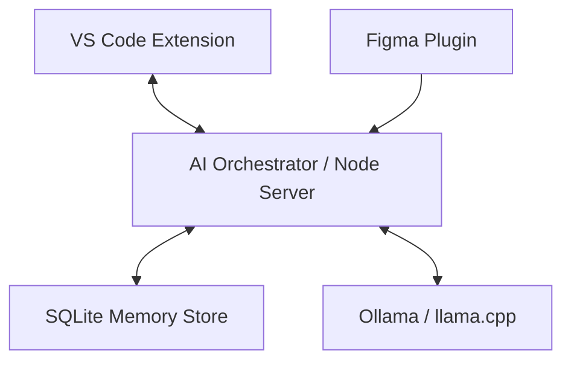

# 🧠 JARVISX: Local Cursor Dev OS

This document provides a complete overview of the **local-cursor-dev-os** project, a personal, local, full-stack AI development system implementation.

---

## 🏗️ ARCHITECTURE OVERVIEW



### 1. VS Code Extension (`/vscode-extension`)
A Cursor-style extension for internal AI-powered development.
- **Chat Panel**: A dedicated webview for interacting with the AI.
- **Inline Editor**: High-speed code editing directly in the editor.
- **Diff Preview**: Native VS Code diff viewer to review AI changes before applying.
- **Streaming UI**: Integrated token-by-token streaming for real-time feedback.

### 2. AI Server (`/ai-server`)
The central hub for all AI operations.
- **Node/Express**: Acts as a gateway between the tools and the AI models.
- **Streaming Service**: Standardized EventStream responses for the frontend.
- **Authentication**: Token-based security (`x-api-key`) for local process isolation.
- **Health Engine**: Monitors connectivity to the local AI backend (Ollama).
- **Prompt Orchestrator**: Handles context injection and model-specific formatting.

### 3. Figma Plugin (`/figma-plugin`)
Design-to-Code integration.
- **UI Serialization**: Exports complex Figma node trees into a structure the AI can understand.
- **Direct Bridge**: Sends serialized design data straight to the AI Server with one click.

### 4. Memory Store (`/memory`)
- **SQLite Schema**: Optimized table structure for storing project history, embeddings, and context-aware snapshots.

---

## ✅ WHAT HAS BEEN IMPLEMENTED

### Core Components
- [x] Initial monorepo structure and Git baseline.
- [x] VS Code Command registrations and UI scaffolding.
- [x] Express.js bridge with error handling.
- [x] Inline editing logic with VS Code workspace edits.
- [x] Figma UI tree serialization and HTM/JS plugin interface.
- [x] Autonomous agent loop for chain-of-thought processing.

### Production Hardening
- [x] **Streaming**: Implemented `text/event-stream` for low-latency feedback.
- [x] **Security**: Middleware-driven API key protection.
- [x] **Robustness**: Health check endpoints and connection monitoring.
- [x] **Infrastructure**: Full TypeScript configuration, `package.json` manifests, and build scripts.

---

## 🚀 HOW TO RUN THE SYSTEM

### Prerequisites
- **Node.js**: v20+ (LTS recommended)
- **Git**: For version control
- **Ollama**: Running locally on port `11434` with `mistral-lora` (or your preferred model).

### Step-by-Step
1.  **Start AI Server**:
    ```powershell
    cd ai-server
    npm start
    ```
2.  **Launch VS Code Extension**:
    - Open the `vscode-extension` folder in VS Code.
    - Press `F5` to start the "Extension Development Host".
3.  **Run Figma Plugin**:
    - Manage Plugins -> Import from manifest -> `figma-plugin/manifest.json`.

---

## 📡 CURRENT STATUS: READY FOR USE
The project is fully compiled and committed to:
`https://github.com/AsithaLKonara/JarvisX-Extension.git`
